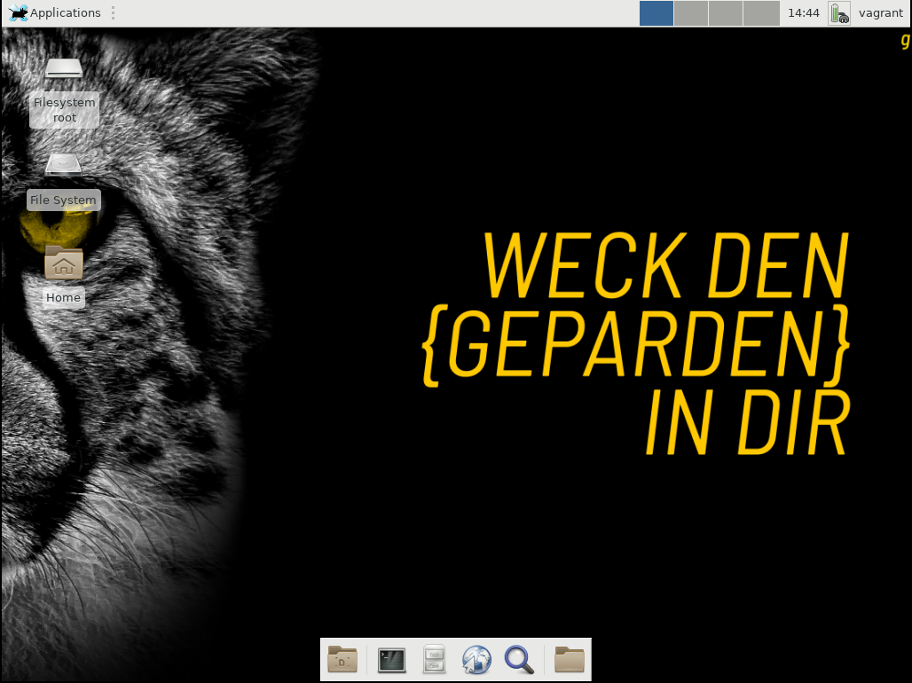

[](https://travis-ci.com/ckaserer/ansible-role-desktop)


# ckaserer.desktop

<p align="center">

</p>

---

There are two variants you can use the desktop role. Either you just install a desktop and let the users log in by themselves or you can enable autologin to a specific user by setting `autologin_user`.

Either way we need to install the latest version of the desktop ansible role from ansible galaxy via

```
ansible-galaxy install ckaserer.desktop
```

---

## Default

The playbook below installs a desktop environment on all hosts.
Alternativly you can set `hosts` to a group of ansible nodes or `localhost`.
Executing the role requires root privileges hence the additional `become: true` in the `include_role` task.

```
- hosts: all
  tasks:
    - name: "Include ckaserer.desktop"
      include_role:
        name: "ckaserer.desktop"
        apply:
          become: true
```

---

## Enable Autologin

The playbook below installs a desktop environment on all hosts and enables autologin as specified by `autologin_user`.
Executing the role requires root privileges hence the additional `become: true` in the `include_role` task.
You can set `hosts` to a group of ansible nodes or `localhost` if you want to specify a subset of nodes.

```
- hosts: all
  tasks:
    - name: "Include ckaserer.desktop"
      include_role:
        name: "ckaserer.desktop"
        apply:
          become: true
        vars:
          autologin_user: ckaserer
```    
